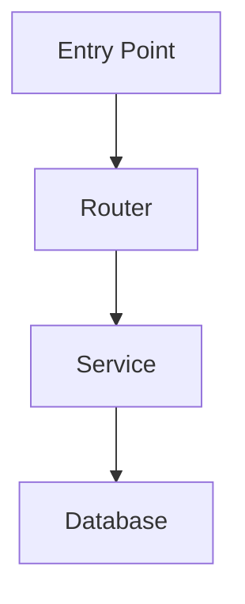

# Wiki Schema & Maintenance Guide

## What This Wiki Is

This wiki is the LLM's working memory for **shadow-ide**. It is not static documentation — it must stay in sync with the codebase. Every time code changes in a meaningful way, the relevant wiki pages must be updated to reflect that change.

The wiki exists so that any agent opening this project can immediately understand the codebase without re-reading all the source files. It compounds over time: each session leaves the wiki more accurate and complete than before.

---

## Structure

The wiki is organized by **kind** — every page belongs to one. Each kind lives in its own directory and has a structural contract (`_mapping-template.md`) defining required sections and frontmatter.

| Path | Kind | Audience | Purpose |
|------|------|----------|---------|
| `index.md` | overview | all | Master index — links to every page |
| `project-discovery.md` | overview | dev,agent | High-level project summary, entry points, key directories |
| `code-structure.md` | overview | dev,agent | Full folder tree, file inventory, verified statistics |
| `architecture/overview.md` | architecture | dev,agent | System diagram, architectural layers, key patterns, data flows |
| `architecture/tech-stack.md` | architecture | dev,agent | Full tech stack with exact versions |
| `components/*.md` | component | dev,agent | One page per major module or logical component |
| `features/*.md` | feature | user,agent | One page per user-visible capability |
| `workflows/*.md` | workflow | user,agent,dev | End-to-end user journeys composing multiple features |
| `integrations/*.md` | integration | dev,agent | External dependencies (third-party APIs, hardware, SDKs) |
| `actions/*.md` | action | agent,dev | Executable operations the agentic in-app assistant can dispatch |
| `decisions/*.md` | decision | dev,agent | Architecture Decision Records (ADRs) |
| `glossary/*.md` | glossary | all | Cross-cutting domain terminology |
| `query-results/*.md` | query-result | varies | Filed answers from `/query` sessions |
| `prompts/*.md` | (workflow prompt) | agent | Single-source-of-truth prompts read by `/ingest`, `/query`, `/lint` |
| `mapping-log.md` | mapping-log | dev,agent | Chronological record of every mapping and update session |
| `manifest.json` | (generated) | agent | Regenerated index by `/lint`; consumed by `wiki-mcp` server |
| `_schema.md` | schema | dev,agent | This file — conventions and maintenance rules |
| `frontmatter-schema.md` | schema | dev,agent | Canonical frontmatter spec |
| `manifest-schema.md` | schema | dev,agent | Locked manifest.json shape |
| `ingest-schema.md` / `lint-schema.md` / `query-schema.md` | schema | agent | Operation workflows |
| `work-modes-schema.md` | schema | agent | Canonical capability profile contract for read-only, read/write, and KB-maintenance modes |
| `work-modes.md` | schema | dev, agent | Project-local work mode policy installed from the template |
| `work-mode-examples.md` | schema | dev, agent | Concrete examples for QA, AI-agent editing, KB maintenance, architecture, and CI modes |

---

## Reading the Wiki

**Start at `index.md`.** It links to every page and shows the current mapping status.

Before editing any module, read its component page in `components/`. Before designing a new feature or making architectural decisions, read `architecture/overview.md` and any component pages it will touch.

If a component page is missing or marked `status: stub`, treat that area of the codebase as unmapped — read the source files directly and update the wiki as part of your work.

---

## Updating the Wiki

### When you change code in an existing module

1. Read the component page for that module (`components/[name].md`)
2. Update any sections that are now inaccurate: **How It Works**, **API / Interface**, **Data Flow**, **Dependencies**
3. If you added or removed error handling, update **Error Handling**
4. Update `status` in the frontmatter if completeness changed
5. Update `mapped_date` to today's date
6. Append an entry to `mapping-log.md`

### When you add a new module

1. Copy `components/_mapping-template.md` to `components/[name].md`
2. Fill in all sections — do not leave placeholder comments in a `status: complete` page
3. Add a `[[wikilink]]` to the new page from `index.md` (under the Components section)
4. Cross-link from related existing component pages (their **Related Pages** and **Dependencies** sections)
5. Update `index.md` mapping status table
6. Append an entry to `mapping-log.md`

### When you delete or rename a module

1. Delete or rename the component page accordingly
2. Find all wikilinks pointing to it: `grep -r "[[component-name]]" wiki/`
3. Update every wikilink found — fix or remove as appropriate
4. Update `index.md`
5. Append an entry to `mapping-log.md`

### When architecture changes significantly

1. Update `architecture/overview.md` — redraw the system diagram if needed
2. Update `architecture/tech-stack.md` if versions or dependencies changed
3. Update `project-discovery.md` if entry points, key directories, or the high-level summary changed
4. Append an entry to `mapping-log.md`

---

## Operations

Wiki maintenance uses two formal operation schemas. Both live in this vault alongside this file.

### Ingest — when code changes

Run when: any source code change, new module, deleted module, refactor, or dependency update.

Read `ingest-schema.md` in this vault for the complete phased workflow (Phases I-0 through I-6).

Brief: triage affected pages → read changed source → update component pages → update architecture pages if needed → update index → append to log → verify wikilinks.

### Lint / Maintain — periodic health check

Run when: several Ingest sessions have accumulated, a major refactor has happened, or the wiki feels stale.

Read `lint-schema.md` in this vault for the complete phased workflow (Phases L-0 through L-7).

Always runs in Fix mode: scans the wiki and applies all fixes in the same session.

Brief: wikilink integrity scan → staleness scan → cross-reference scan → duplicate detection → apply fixes → log.

### Query — ask the wiki

Run when: you have a question about this codebase and want a cited, structured answer.

Read `query-schema.md` in this vault for the complete phased workflow (Phases Q-0 through Q-5).

Answers can take any format (markdown summary, comparison table, Mermaid diagram, Marp slide deck, code example) — the schema selects the best format automatically. Valuable answers (synthesizing 3+ pages, revealing non-obvious connections, producing reusable analyses) are filed automatically as `query-results/[title].md` pages and wired into `index.md`.

### Work Modes

Read `work-modes-schema.md` for the reusable capability contract and
`work-modes.md` for this project's local policy. Work modes answer a separate
question from page audience tags: what is the current actor allowed to do?

- `qa-readonly` may read KB and source evidence, but must not edit files.
- `human-dev-readwrite` and `agent-dev-readwrite` may edit source when the user
  asks for implementation work, and must run ingest after source changes.
- `kb-maintainer` may update wiki pages but must not edit source.
- `architect` plans and records decisions; implementation edits require a
  read/write mode.

---

## Conventions

### Frontmatter

Every wiki page has YAML frontmatter. **Read [[frontmatter-schema]] for the full canonical spec.** Universal fields:

```yaml
---
slug: <project_slug>/<kind>/<name>     # globally unique, kebab-case
project_slug: <kebab-case>             # locked at bootstrap
kind: component | feature | workflow | integration | decision | glossary | architecture | query-result | action | mapping-log | overview | schema
audience: [dev, user, agent]           # one or more — avoid `all` (drift trap)
version: 1                             # bumps on meaningful content change
last_updated: YYYY-MM-DD               # auto-stamped on every edit
mapped_date: YYYY-MM-DD                # original creation date — never changes
status: stub | partial | complete
tags: [relevant, tags]
---
```

Page-kind-specific fields (cross-references, action endpoint metadata, integration vendor/protocol, decision status) are documented in [[frontmatter-schema]].

**Status definitions:**
- `stub` — file exists, placeholder comments still present, minimal real content
- `partial` — some sections filled in, but others still have `<!-- TODO -->` comments or empty tables
- `complete` — every section has real content, no TODOs, no placeholder comments remain

Do not set `status: complete` if any `<!-- TODO -->` or `<!-- LLM:` comment remains.

### Audience tagging

Three audiences:
- **`dev`** — software engineers, designers, contributors who read the wiki to understand or modify code.
- **`user`** — end users (probationers, officers, etc.) who interact with the app via the agentic in-app assistant. They never read the wiki directly; the assistant queries it on their behalf.
- **`agent`** — AI agents (Claude/Cursor/Codex, MCP consumers) that read the wiki programmatically. Almost every page should include `agent`.

**Avoid `audience: [all]`.** It hides drift — pages tagged `all` accumulate prose appropriate to one audience but inappropriate to others, and MCP queries that filter by audience start returning garbage. If you must use it, the page MUST contain three section headers (`## For developers`, `## For users`, `## For agents`) — lint enforces this.

Single-audience pages (e.g. `audience: [dev, agent]`) do NOT need section-level audience headers — the whole page is for that audience. This is the normal case.

### Links

- Use `[[wikilinks]]` for all internal links between wiki pages
- Use `[[page#section]]` for section-specific links
- Reference source files with inline code: `` `src/module/file.py` ``
- Never use absolute paths in wikilinks — they break when the vault moves

### Diagrams

Mermaid renders natively in Obsidian. Use it for all diagrams:



For request/response flows, use `sequenceDiagram`. For state machines, use `stateDiagram-v2`.

### Statistics and Counts

All counts (files, tables, models, routes, etc.) must be verified with shell commands, not estimated by reading. Record the command used as a comment next to the count:

```markdown
| Python source files | 287 | `find . -name "*.py" -not -path "*/venv/*" | wc -l` |
```

---

## Wikilink Integrity

Before marking any session complete, verify that all wikilinks resolve:

```bash
# Find all wikilinks in the wiki
grep -r "\[\[" wiki/ --include="*.md" -h | grep -o "\[\[[^\]]*\]\]"
```

Every `[[target]]` must correspond to a file at `wiki/target.md` or `wiki/target/index.md`. Broken wikilinks create dead nodes in the Obsidian graph and mislead future agents.

---

## Mapping Log Format

Every session that touches the wiki appends one entry to `mapping-log.md`:

```markdown
### YYYY-MM-DD — [Brief description of what was done]
- **What:** Summary of changes made
- **Files touched:** List of wiki files modified
- **Notes:** Anything worth knowing for future sessions
```
