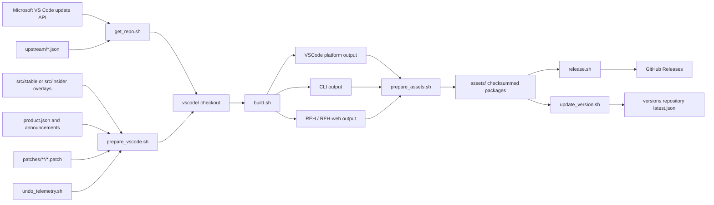

# Architecture Overview

> Shadow-IDE is built by selecting upstream VS Code, applying a repository-controlled overlay and patch set, producing platform artifacts, and publishing release/update metadata.

## System diagram

## Architectural style

The repo uses a scripted overlay architecture:

- Source of truth for editor behavior remains upstream VS Code at a pinned commit.
- Shadow-IDE/VSCodium-specific files are layered into upstream through `src/<quality>/`.
- Behavioral differences are expressed as patch files, not long-lived forked source trees.
- Build and packaging behavior is driven by Bash scripts and GitHub Actions env.
- Release outputs are immutable assets plus update metadata, not a running service owned by this repo.

This style is captured in [[decisions/track-upstream-vscode-by-scripted-overlay]].

## Build phases

1. **Select upstream** - `get_repo.sh` reads `upstream/<quality>.json` or the VS Code update API.
2. **Prepare checkout** - `prepare_vscode.sh` copies overlays, writes product metadata, removes Copilot extension content, applies patches, installs dependencies, and adjusts platform metadata.
3. **Compile/package base editor** - `build.sh` runs upstream gulp tasks for the selected OS and architecture.
4. **Build auxiliary artifacts** - `build_cli.sh` builds the CLI/tunnel executable; optional REH and REH-web artifacts are built when enabled.
5. **Prepare release assets** - platform `prepare_assets.sh` scripts create tar/zip/dmg/deb/rpm/AppImage/snap/exe/msi assets where applicable.
6. **Publish** - `release.sh` creates/releases assets, and `update_version.sh` writes update metadata.

## CI topology

GitHub workflows split by quality and platform:

- Stable: `publish-stable-linux.yml`, `publish-stable-macos.yml`, `publish-stable-windows.yml`, `publish-stable-spearhead.yml`
- Insider: `publish-insider-linux.yml`, `publish-insider-macos.yml`, `publish-insider-windows.yml`, `publish-insider-spearhead.yml`
- Pull-request/CI checks: `ci-build-linux.yml`, `ci-build-macos.yml`, `ci-build-windows.yml`, `lint-zizmor.yml`

Linux and Windows workflows often split compile and package jobs so a compiled `vscode.tar.gz` artifact can be reused by architecture-specific packaging jobs.

## Trust and side effects

Build scripts can perform high-impact operations: network fetches, dependency installs, release creation, release asset deletion/re-upload, signing submissions, and versions repository pushes. These are represented in [[actions/run-release-pipeline]] and should only run with explicit credentials and operator intent.

## Current Shadow-IDE branding gap

The repository remote is Shadow-IDE, but current tracked defaults still use VSCodium values in many locations. The architecture supports Shadow-IDE branding through env vars, overlays, product metadata, icons, and workflow env blocks, but all product-facing identifiers should be audited together. See [[features/product-branding-and-assets]].

## Related pages

- [[project-discovery]]
- [[architecture/tech-stack]]
- [[components/root-build-orchestration]]
- [[components/github-actions-pipelines]]
- [[workflows/upstream-release-publish]]
- [[index]]
