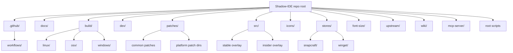

# Code Structure

> Folder and file map for the Shadow-IDE distribution repository.

## Repository tree

## Top-level scripts

| Path | Purpose |
|------|---------|
| `get_repo.sh` | Resolves upstream VS Code tag/commit, clones `Microsoft/vscode`, and exports `MS_TAG`, `MS_COMMIT`, and `RELEASE_VERSION`. |
| `version.sh` | Generates `BUILD_SOURCEVERSION` when one is not provided. |
| `build.sh` | Orchestrates prepare, minified desktop build, CLI build, and optional REH/REH-web build. |
| `prepare_vscode.sh` | Copies overlays, mutates product metadata, applies patches, installs dependencies, and rewrites platform metadata. |
| `prepare_assets.sh` | Delegates packaging assets to platform scripts and creates CLI/REH archives and checksums. |
| `prepare_checksums.sh` | Generates sha1 and sha256 checksum files for release assets. |
| `release.sh` | Creates or updates GitHub releases and uploads assets with checksums. |
| `update_version.sh` | Writes update-service `latest.json` metadata into a versions repository. |
| `check_tags.sh` | Determines whether release assets already exist and whether a build should continue. |
| `build_cli.sh` | Builds the Rust/Node VS Code CLI/tunnel executable for the current platform/arch. |
| `upload_sourcemaps.sh` | Collects and uploads sourcemaps to a configured release. |
| `undo_telemetry.sh` | Applies telemetry cleanup after source preparation. |
| `utils.sh` | Common env defaults and helpers such as `apply_patch` and portable `sed` replacement. |

## Main directories

| Directory | Purpose |
|-----------|---------|
| `.github/workflows/` | CI, publish, lint, stale issue, and moderation workflows. See [[components/github-actions-pipelines]]. |
| `build/` | Platform-specific package preparation for Linux, macOS, Windows, MSI, AppImage, REH, and appx-related outputs. |
| `dev/` | Developer helpers for local builds, patch repair, Docker, API update, and Windows PowerShell build entry. |
| `docs/` | User and operator docs for build, migration, usage, telemetry, extensions, accounts, troubleshooting, and patches. |
| `font-size/` | TypeScript utility that generates CSS patch material for workbench font-size customization. |
| `icons/` | Source SVG/PNG assets and the icon generation pipeline. |
| `patches/` | Ordered patch inventory applied to upstream VS Code. Shared patches live at the root; platform-specific patches live in subdirectories. |
| `src/stable` and `src/insider` | Overlay resources copied into the upstream `vscode/` checkout before patching and building. |
| `stores/` | Snapcraft and WinGet metadata/check scripts. |
| `upstream/` | Stable and insider VS Code tag/commit pins. |
| `wiki/` | This kbmap knowledge base. |
| `mcp-server/` | Read-only MCP server generated by kbmap for querying `wiki/`. |

## Generated or transient directories

The build process creates directories such as `vscode/`, `VSCode-*`, `vscode-*`, `assets/`, `sourcemaps/`, `vscode-cli/`, and platform package staging directories. These are build outputs, not durable source ownership roots.

## Patch inventory

Shared patches include build fixes, telemetry removal, update behavior, extension-gallery settings, command filtering, UI behavior, Copilot/GitHub changes, remote support changes, and custom font behavior. Platform-specific patch directories include:

- `patches/linux/` and `patches/linux/client/`
- `patches/windows/`
- `patches/osx/`
- `patches/alpine/reh/`
- `patches/insider/`
- `patches/user/`

See [[components/patch-set]] and [[workflows/patch-refresh-after-upstream-change]] before editing these files.

## Knowledge-base files added by kbmap

The knowledge-base adoption added:

- `AGENTS.md`, `CLAUDE.md`, and `replit.md`
- `.claude/commands/*.md`
- `.claude/settings.json`
- `MCP-INSTALL.md`
- `wiki-cli.py`
- `wiki/`
- `mcp-server/`

These files are part of [[features/knowledge-base-read-side-access]] and should remain in sync with this repo.

## Related pages

- [[project-discovery]]
- [[architecture/overview]]
- [[components/root-build-orchestration]]
- [[components/patch-set]]
- [[index]]
