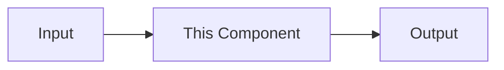

<!--
STRUCTURAL CONTRACT — READ BEFORE EDITING

This file defines the required structure for every component page.
When creating a new component page:

1. Copy this entire file to OUTPUT_PATH/components/[name].md
2. Fill in each section IN ORDER — do not skip, reorder, or remove sections
3. Every ## heading below is MANDATORY and must appear in this exact order
4. Add component-specific subsections as ### under the appropriate ## heading
5. Do NOT add new ## headings — keep custom content as ### under existing ones
6. If you cannot fill a section yet, leave the placeholder comment and set status: partial
7. Only set status: complete when EVERY section has real content (no TODO comments)
8. Every [[wikilink]] you write must point to a page that exists or will exist in the same phase

Section order: Purpose → Source Location → Key Files → How It Works → Error Handling → Dependencies → Data Flow → API / Interface → Open Questions → Related Pages
-->

# Component Name

> One-line summary of what this component/module does.

## Purpose

<!-- Why does this exist? What problem does it solve? -->

## Source Location

<!-- Relative path from project root, e.g. src/auth/ -->

## Key Files

| File | Purpose |
|------|---------|
| | |

## How It Works

<!-- High-level description of the component's behavior.
     Add ### sub-sections here for component-specific topics
     (e.g. ### Authentication Flow, ### Parser Strategy, etc.)

     Guide by component type:
     - Business logic: describe the main algorithm or decision tree. Use ### sub-sections for major branches (Happy Path, Error Handling, Edge Cases).
     - Data processing: describe the transformation pipeline step by step. A Mermaid diagram is preferred.
     - Routers / orchestrators: describe control flow and possible outcomes, not data transformation. What triggers this component? What are the possible outcomes? What state changes?
     - Library / utility: describe key behaviors and show one concrete usage example.

     Depth: enough to understand the component without reading source. Usually 100–300 words + optional diagram. -->

## Error Handling

<!-- How does this component handle failures?
     - Does it raise exceptions, return error objects, or fail silently?
     - Are errors logged? Where?
     - How do upstream callers know something went wrong?
     - Are failure modes tested?
     If error handling is trivial or not applicable, write "Errors propagate to caller." or similar. -->

## Dependencies

### Depends On

<!-- [[wikilinks]] to component pages this depends on.
     Also list external dependencies (databases, APIs, services). -->

### Used By

<!-- [[wikilinks]] to component pages that consume this. -->

## Data Flow

<!-- Mermaid diagram showing data flow through this component.
     Replace the placeholder below with an actual diagram.
     If data flow is trivial, write a one-line description instead. -->

## API / Interface

<!-- What does this component expose to the rest of the system?
     Endpoints, exports, public methods, events, CLI commands.
     This section answers: "If another component wants to USE this, what do they call?" -->

## Open Questions

<!-- Anything unclear that needs clarification from the user.
     Mark each with <!-- TODO: clarify --> so they're searchable.
     If nothing is unclear, write "None at this time." -->

## Related Pages

<!-- Links to the standard overview pages plus any closely related component pages.
     At minimum, include these three: -->

- [[project-discovery]]
- [[code-structure]]
- [[index]]
