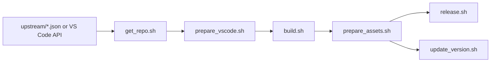

# Root Build Orchestration

> Top-level Bash scripts coordinate upstream checkout, preparation, compilation, packaging, release upload, and update metadata.

## Purpose

This component is the command spine of the repository. It turns a selected upstream VS Code commit into platform artifacts and published release metadata.

## Source Location

Repository root.

## Key Files

| File | Purpose |
|------|---------|
| `get_repo.sh` | Resolves and checks out upstream VS Code. |
| `version.sh` | Produces `BUILD_SOURCEVERSION`. |
| `build.sh` | Runs prepare, gulp packaging, CLI, and REH build phases. |
| `prepare_vscode.sh` | Applies overlays, product metadata, patches, deps, and telemetry cleanup. |
| `prepare_assets.sh` | Creates release assets and checksums. |
| `release.sh` | Creates GitHub releases and uploads assets. |
| `update_version.sh` | Writes update metadata to the versions repo. |
| `check_tags.sh` | Decides whether a build should continue. |
| `utils.sh` | Shared env defaults and patch helpers. |

## How It Works

`get_repo.sh` sets `MS_TAG`, `MS_COMMIT`, and `RELEASE_VERSION`, then fetches the upstream source into `vscode/`. `build.sh` calls `prepare_vscode.sh`, then invokes upstream gulp tasks for the active OS/architecture. Packaging and release scripts consume the resulting `VSCode-*`, `vscode-reh-*`, and `vscode-cli` outputs.

## Error Handling

Scripts use `set -e` or `set -ex`, so failures usually abort the pipeline. Network and npm steps often include retry loops. Release upload has retry/delete/re-upload logic in `release.sh`.

## Dependencies

### Depends On

- [[components/upstream-version-metadata]]
- [[components/vscode-overlay-and-product-metadata]]
- [[components/patch-set]]
- [[components/platform-build-packaging]]

### Used By

- [[components/github-actions-pipelines]]
- [[workflows/local-development-build]]
- [[workflows/upstream-release-publish]]

## Data Flow

## API / Interface

Primary CLI entry points are `./dev/build.sh`, `. get_repo.sh`, `./build.sh`, `./prepare_assets.sh`, `./release.sh`, and `./update_version.sh`.

## Open Questions

None at this time.

## Related Pages

- [[project-discovery]]
- [[code-structure]]
- [[actions/run-dev-build]]
- [[actions/run-release-pipeline]]
- [[index]]
