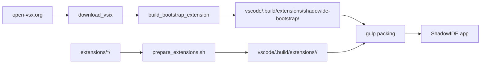

# ShadowIDE Extensions Bundling

> Build-time mechanism that copies Shadowtrack-controlled extensions into the upstream VS Code build output so they ship pre-installed in `ShadowIDE.app`.

## Purpose

Upstream VS Code recognizes "built-in" extensions in `vscode/.build/extensions/<id>/`. Anything placed there before the platform-specific gulp packing step is bundled into the produced `.app`. This component owns that drop-in: a single Bash script (`prepare_extensions.sh`) plus a source directory (`extensions/`) for first-party Shadowtrack extensions.

Two patterns are handled:

1. **Generated bootstrap extension** — `shadowide-bootstrap` is built dynamically from string templates inside the script. It bundles a downloaded Cline `.vsix` and installs it on first launch as a normal user extension (so it gets the Update button).
2. **Source-tree extensions** — every subdirectory of `extensions/` (e.g. `extensions/shadowide-agents/`) is copied verbatim into `vscode/.build/extensions/<name>/`.

## Source Location

- `prepare_extensions.sh` (repo root)
- `extensions/` (repo root) — source for any first-party Shadowtrack extensions
- `.build/shadowide-extensions/` (repo root, gitignored) — cache for downloaded `.vsix` files

## Key Files

| File | Purpose |
|------|---------|
| `prepare_extensions.sh` | Orchestrates download, bootstrap construction, and source-extension copy. |
| `extensions/<name>/package.json` | Extension manifest — registers commands, views, activation events. |
| `extensions/<name>/extension.js` | Plain-JS extension entry point (no compile step). |

## How It Works

The script runs from `build.sh` after `gulp vscode-min-prepack` (which recreates `vscode/.build/extensions/`) and before the platform-specific packing step. Order matters: prepack would otherwise wipe our drops.

### Bootstrap construction

`build_bootstrap_extension` writes a tiny VS Code extension on the fly that, on first launch, installs the bundled Cline `.vsix` via `workbench.extensions.installExtension`. Cline then lives as a normal user-installed extension with the Update button intact, so it auto-updates from open-vsx like any marketplace extension. Re-installs are gated by a `globalState` flag (`shadowide.bootstrap.clineInstalled`) so users who deliberately uninstall Cline aren't fought.

### Source-tree copy

Each subdir of `./extensions/` is `cp -R`'d into `vscode/.build/extensions/<name>/`. Extensions written in plain JS bypass the gulp compile pipeline used for first-party VS Code extensions like `git`, `bat`, etc. — they're treated as already-built bundled extensions, identical to how downloaded built-ins (e.g. `ms-vscode.js-debug`) are treated.

### Build pipeline integration

`build.sh` invokes the script via `( cd .. && . ./prepare_extensions.sh )` between prepack and packing. The script is sourced (not exec'd) so its env defaults can be overridden upstream.

## Error Handling

Failures abort under `set -euo pipefail`. Network failure on the Cline download exits non-zero with the failed URL. Missing `extensions/` source dir is silently skipped (the loop guards on `-d`). Collisions in `vscode/.build/extensions/<name>/` are resolved by deleting the prior drop before copying.

## Dependencies

### Depends On

- [[components/root-build-orchestration]] — the script is invoked from `build.sh`
- [[integrations/open-vsx-registry]] — Cline `.vsix` is fetched from open-vsx
- [[integrations/cline-kanban]] — bundled `kanban` consumer in `extensions/shadowide-agents/`

### Used By

- [[components/platform-build-packaging]] — gulp packing copies `vscode/.build/extensions/` into the `.app`
- [[features/agents-window]]

## Data Flow

## API / Interface

Environment overrides:

| Variable | Default | Purpose |
|---|---|---|
| `SHADOW_AGENT_VERSION` | `3.82.0` | Pinned Cline version to bundle |
| `EXT_CACHE_DIR` | `./.build/shadowide-extensions` | `.vsix` download cache |
| `VSCODE_EXT_DIR` | `./vscode/.build/extensions` | Drop target |
| `SOURCE_EXT_DIR` | `./extensions` | Source-tree extensions root |

## Open Questions

None at this time.

## Related Pages

- [[project-discovery]]
- [[code-structure]]
- [[components/root-build-orchestration]]
- [[components/patch-set]]
- [[features/agents-window]]
- [[integrations/cline-kanban]]
- [[index]]
